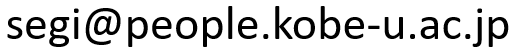

このリポジトリでは，トリップチェイン全体の効用を最大化する旅行者の意思決定を明示的に表現した，観光周遊行動モデルを扱うためのプログラムを公開しています。トリップチェインの観測データを用いたモデルの推定や、推定結果を利用したトリップチェインの予測を行うことができます。

プログラムについての問い合わせは，下記のメールアドレスにお願いします．




## Cythonライブラリのインストール

このプログラムを用いるには，Python環境およびCythonライブラリが必要です。

お使いのPython環境にCythonライブラリがインストールされていない場合は，プロンプト上で以下のコマンドを入力してインストールを行って下さい。

```
pip install Cython
```

### Windows環境の注意点

Windows環境でCythonプログラムをコンパイルするには，C/C++のコンパイラ（Visual Studio）の導入が必要です。コンパイラは無償で利用可能です。

以下の手順に従って，必要な機能をインストールしてください。

1. Visual Studio Communityのインストール

- [Microsoftの公式サイト](https://visualstudio.microsoft.com/downloads/)にアクセスし、「Visual Studio Community」をダウンロードします。
- インストーラを起動し，「Python開発」を選択してインストールします。

2. Build Tools for Visual Studioのインストール

- [同じページ](https://visualstudio.microsoft.com/downloads/)の「Tools for Visual Studio」セクションから「Build Tools for Visual Studio」をダウンロードします。
- インストーラを起動し，「C++によるデスクトップ開発」を選択してインストールします。

## プログラムのダウンロードとコンパイル

[codesフォルダ](./codes)内のファイルを全て同一のフォルダにダウンロードして下さい。ファイルの内容は以下の通りです。

- `trip_chain_simulator.pyx`, `trip_chain_simulator.pxd`：観光周遊行動モデルを扱うライブラリの本体です。
- `geneticr.pyx`, `geneticr.pxd`：実数値の遺伝的アルゴリズムによる関数最適化を行うライブラリです。
- `mt19937ar.c`：メルセンヌツイスタによる乱数生成を行うCコードです。[開発者により公開されているコード](https://www.math.sci.hiroshima-u.ac.jp/m-mat/MT/MT2002/mt19937ar.html)を編集したものです。
- `setup.py`：コンパイルに利用するPythonファイルです。
- `execute.py`：`trip_chain_simulator`ライブラリの利用例が載っているPythonファイルです。

ファイルを全てダウンロードしたら、以下のコマンドを実行してプログラムをコンパイルして下さい。

```
python setup.py build_ext --inplace
```

コンパイルは一度実行すれば、それ以降は行う必要はありません。


## 設定ファイルとデータファイルの準備

`trip_chain_simulator`ライブラリを使うには、以下の設定ファイルとデータファイルを準備する必要があります。これらのファイルは全てカンマ区切りのCSVファイルとして用意される必要があります。
テストデータ用のファイルは[test-dataフォルダ](./test-data)に置かれています。

### 設定ファイル

設定ファイルは以下の表のような4行2列のCSVファイルとして用意されます。
[test-dataフォルダ](./test-data)内の`input settings.csv`が例です。
1列目は項目名、2列目は設定値です。
項目名の順序は固定されており、変更してはいけません。

| Number of places | 10 |
| :---: | :---: |
| Number of ports | 2 |
| Shift parameter of Poisson likelihood | 0.0001 |
| OD cost normalization | 0 |

各項目の意味は以下の通りです。

- `Number of places`: 旅行者が訪問可能な場所（観光地）の数です。これらの場所はトリップチェインの起点・終点になることはできません。
- `Number of ports`: トリップチェインの起点・終点となることができる場所（空港など）の数です。これらの場所は旅行者の訪問の対象となることはできません。
- `Shift parameter of Poisson likelihood`: ポアソン疑似尤度を評価する際に、ゼロ予測値を避けるための補正項。通常は0.0001に設定することを推奨します。
- `OD cost normalization`: 旅行費用の単位が分析に影響を与えることを防ぐため、OD旅行費用はこの設定値で除されて基準化されたうえで、プログラムに利用されます。この設定値にゼロを指定すると、OD旅行費用の95%タイル値が基準化に使われます。

Number of placesを$`K`$、Number of portsを$`M`$とするとき、各Place・Portには以下のIDが振られます。

- Place: 0, 1, 2, ..., $`K - 1`$
- Port: $`K`$, $`K + 1`$, ..., $`K + M - 1`$

### OD旅行費用のデータファイル

OD旅行費用のデータファイルは、Place・Port間の旅行費用を記録した、3列のファイルとして用意されます。
[test-dataフォルダ](./test-data)内の`input od cost.csv`が例です。
1列目は起点のID、2列目は終点のID、3列目がOD間の旅行費用です。
列の順序は固定されており、変更してはいけません。

あるOD間の旅行費用の設定が無い場合、当該OD間の旅行費用はゼロとして扱われます。
異なるPort間の旅行費用は設定可能ですが、プログラム中で使われることはありません。


このプログラムが用いる，河床標高の設定方法を述べます．このプログラムは，広矩形単断面を持つ開水路の不等流計算の基礎式である，
```math
\frac{dH}{dx} + \frac{1}{2g} \frac{d}{dx} \left( \frac{Q}{Bh} \right)^2 + \frac{n^2 Q^2}{B^2 h^{10/3}} = 0
```
を用いています．ここで，$`H`$は水面標高(m)を
